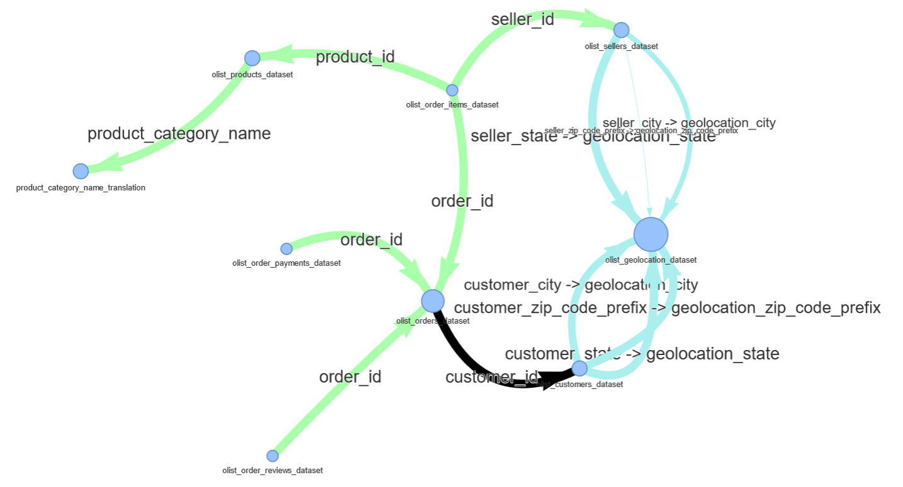
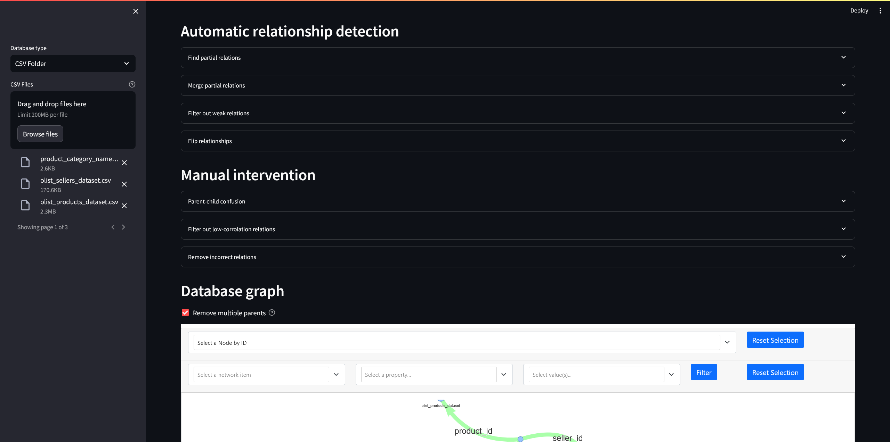
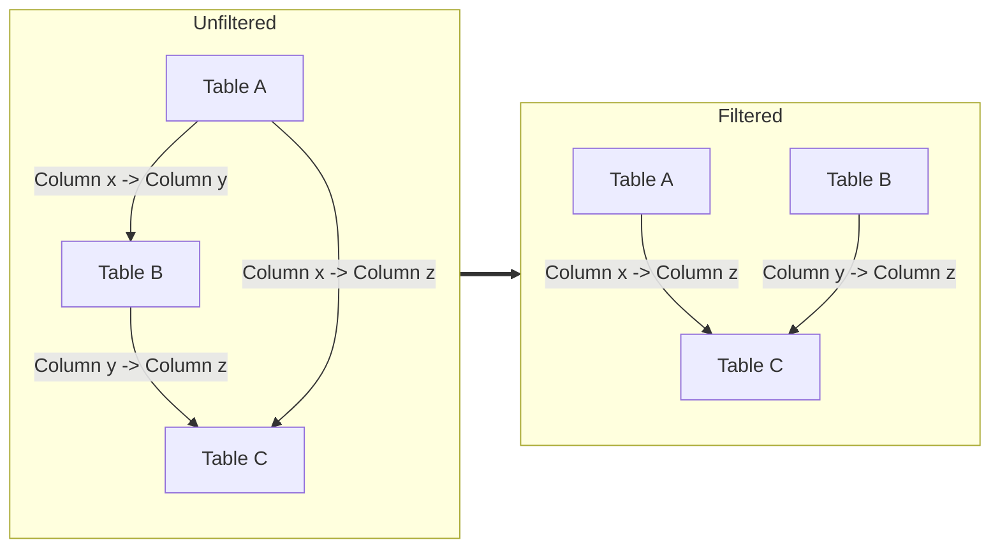

# Scheminer

An attempt to write a tool to infer the schema of an arbitrary database.

Tested on the [Brazilian E-Commerce Public Dataset by Olist](https://www.kaggle.com/datasets/olistbr/brazilian-ecommerce). The rules and heuristics should generalize to other datasets as well, but no guarantees.

| Actual schema (incomplete)                          | Infered Schema                                  |
| --------------------------------------------------- | ----------------------------------------------- |
|  |  |

## Usage

The project is built using [PDM](https://pdm-project.org/en/latest/) as its package manager, but can be installed using any PEP517 compliant package manager. To use the UI, however, it's required to install the dev dependencies, which are defined in a PDM-specific section of the `pyproject.toml`

To install using PDM, it's sufficient to just type:

```sh
pdm install -d # For dev
```

With Pip, first type:

```sh
pip install -e .
```

Then separately install the following dependencies to use the UI:

```txt
streamlit>=1.32.2
pyvis>=0.3.2
plotly>=5.20.0
matplotlib>=3.8.4
scipy>=1.13.0
streamlit-agraph>=0.0.45
```

Now the UI can be ran using the following command:

```sh
streamlit run debug-ui.py
```

Currently Scheminer only supports databases in the form of a list of CSV tables, which can be uploaded to the Streamlit UI.



## How it works

Scheminer relies one two basic assumptions for resolving the schema of a database:

- If column A is a subset of column B, it is likely a foreign key to column B.
- If column A is a subset of column B and C, but column B is also a subset of column C, column C is likely the actual parent column.

In the real world, we do encounter some difficult to resolve cases:

- In one-to-one relations, which column is actually the parent?
- In many-to-many relations (which sadly do occur in badly normalized databases), which column is actually the parent?
- Some columns like counts can easily be a subset of a numerical incremental index (1, 2, ..., 200 is easily a subset of 1, 2, ... 10.000.000).
- If A should be a subset of B, but B has deleted records that didn't cascade down to A, this relation is only detected if we allow for some tolerance or "fuzzy" subsets.

In the future, these cases may be (partially) resolved using NLP techniques on column and table names. For now, however, these require manual intervention.

The general schema mining process can be split into three phases:

1. Relationship detection
   - Analyze column contents to detect relationships
2. Manual intervention
   - Clean detection errors
3. Graph-based schema resolution
   - Analyze the graph to keep the minimum valid schema

### Relationship detection

1. Detect unidirectional relations (one-to-X, many-to-X)
   - Calculate relationship strength, the fraction of values of $A$ found in $B$ $\frac{|A \cup B |}{|A|}$
   - Calculate one-sided cardinality. If the unique values of $A$ in $B$ are equal to the total values of $A$ found $B$, cardinality is one-to-X, else many-to-X.
2. Merge unidirectional relations into fully qualified relations (`one-to-X + many-to-X -> many-to-one`)
   - The table with the greatest strength pointing to the other is likely the child
3. Filter out relations with strength less than 1 (minus tolerance)
   - We only want to keep "full" subsets
4. Flip one-to-many relations to many-to-one
   - We want relations to always point from the child to the parent

### Manual intervention

1. Resolve parent-child confusions
   - Resolve cases where two columns both contain 100% of each other's values and we cannot automatically detect the correct parent-child direction.
2. Filter out low-correlation columns.
   - Try to filter out some falsely detected relations. Some columns may be spurious subsets of other columns. A catagorical [1, 2, 3] column, for example, can be a perfect subset of a numerical index. Such columns will have very little overlap the other way around, however, which we can filter for.
3. Filter out incorrect relations
   - Filter out columns that are spurious subsets of others (often numerical columns)
   - Supported by automatically detecting columns where the parent column has only a weak relation the other way around. This can remove some relations between large indexes and smaller numerical columns.

### Graph resolution

1. For all columns with multiple outgoing edges (parents)
2. Traverse trail of column edges to find top-level ancestors
3. Remove links to parents if they share an ancestor with another parent.
   - _In hindsight, it's also sufficient to just check if a parent has a parent itself. Since $A \subseteq B \cup B \subseteq C \implies A \subseteq C$, we know ancestor of our parent is also detected as an own direct parent._

See the diagram below for an illustration of this step.


